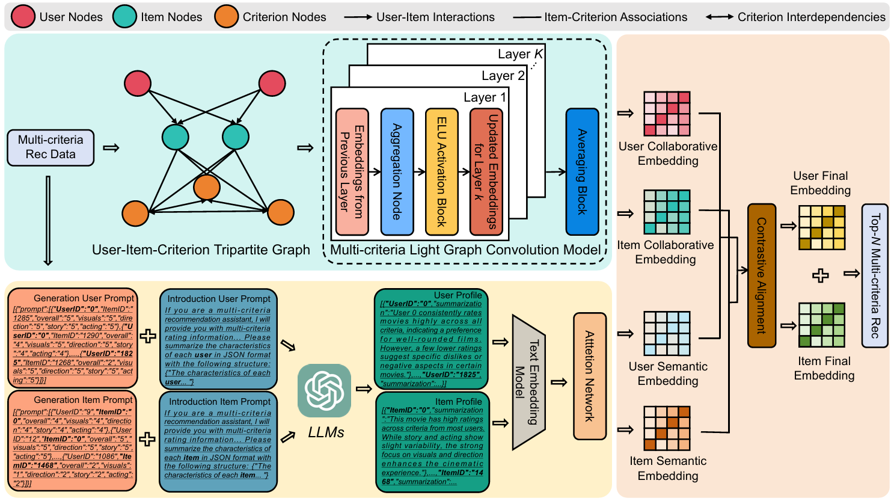

# LGMcRec: Large Language Models-augmented Light Graph Model for Multi-criteria Recommendation

<p align="center">

</p>

## **Overview**
In the digital era of personalization, multi-criteria recommender systems (MCRSs) have emerged as a critical tool for capturing the multidimensional nature of user preferences by leveraging multiple evaluation criteria rather than relying solely on single overall ratings. Despite their potential, existing MCRSs face significant challenges, including graph sparsity, lack of criterion interdependency modeling, and the underutilization of semantic information for recommendation tasks. To address these limitations, we present **LGMcRec** (Large Language Models-augmented Light Graph Model for Multi-criteria Recommendation), a novel framework that integrates the strengths of **graph neural networks (GNNs)** and **large language models (LLMs)** to enhance representation learning and recommendation performance in multi-criteria settings.

## **Project Structure**

```plaintext
├── config/                       # Configuration files and utilities
├── data/                         # Data preprocessing and handling
│   ├── preprocess.py             # Preprocessing raw multi-criteria data
│   ├── data_process.py           # Splitting data and user-item mappings
├── embedding/                    # Embedding generation and alignment
│   ├── generate_profile.py       # Generates user profiles based on prompts
│   ├── generate_emb.py           # Generates user embeddings
├── model/                        # Recommendation models
│   ├── mclightgcn.py             # MCLightGCN implementation
│   ├── attention.py              # Attention mechanisms for embedding alignment
├── train/                        # Training and evaluation utilities
│   ├── trainer.py                # Initializes and handles training
├── utils/                        # Utility functions
│   ├── graph_utils.py            # Graph construction and normalization utilities
│   ├── seed_utils.py             # Seed initialization for reproducibility
│   ├── logging_utils.py          # Logging setup
├── unprocess_dataset/            # Raw datasets for preprocessing
├── User_TA/                      # Outputs of the pipeline
│   ├── user_prompts_TA.json      # Generated user prompts
│   ├── user_profiles_TA.json     # Generated user profiles
│   ├── user_profiles_TA.pkl      # Generated user embeddings
├── main.py                       # Main entry point for the pipeline
├── requirements.txt              # Python dependencies
└── README.md                     # Project documentation
```

## **Prerequisites**

Before setting up the project, ensure you have the following installed:

### **System Requirements**
- Python **3.8+**
- **CUDA** (if running on GPU, ensure you have a compatible NVIDIA driver installed)

### **Libraries**
The project requires the following Python libraries:
- [torch](https://pytorch.org/) (PyTorch for deep learning)
- [recbole](https://recbole.io/) (for recommendation system utilities)
- [openai](https://openai.com/) (to access OpenAI's API for embedding generation)
