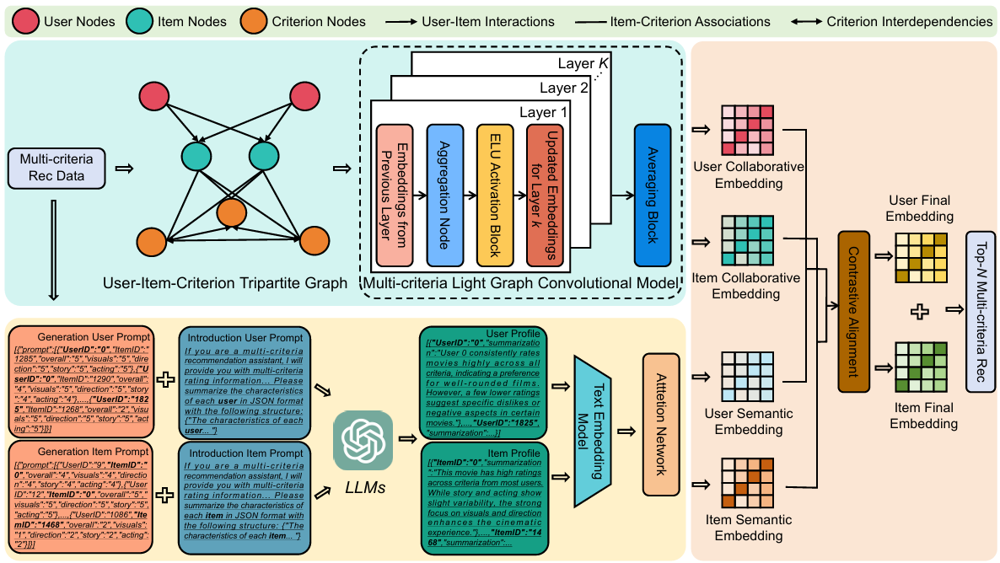

# LGMcRec: Large Language Models-augmented Light Graph Model for Multi-criteria Recommendation

## **Overview**
In the era of digital personalization, multi-criteria recommender systems (MCRSs) play a vital role in capturing the multidimensional nature of user preferences by considering multiple evaluation criteria rather than relying on a single overall rating. However, existing approaches to MCRSs face challenges in managing graph sparsity, criterion independence, and effectively leveraging semantic information for recommendation tasks. To address these limitations, we propose a novel framework named Large \underline{L}anguage Models-augmented Light \underline{G}raph Model for \underline{M}ulti-\underline{c}riteria \underline{Rec}ommendation (LGMcRec). LGMcRec integrates the strengths of graph neural networks (GNNs) and large language models (LLMs) to improve the representation and recommendation capabilities of MCRSs. In our model, we construct a tripartite graph structure that captures user-item interactions, item-criterion associations, and criterion interdependencies, effectively addressing issues of sparsity and unmodeled correlations in multi-criteria data. We extend the LightGCN architecture to learn embeddings over this graph, which are further enriched through semantic alignment with embeddings generated by LLMs from textual user and item profiles. To bridge the gap between graph-based and LLM-based embeddings, we employ a contrastive learning approach that maximizes the mutual information between the two embedding spaces, ensuring cohesive and comprehensive user and item representations. Experimental results on three MCRS datasets demonstrate that LGMcRec achieves significant performance improvements over state-of-the-art methods. To ensure reproducibility, the implementation code will be made publicly available.
